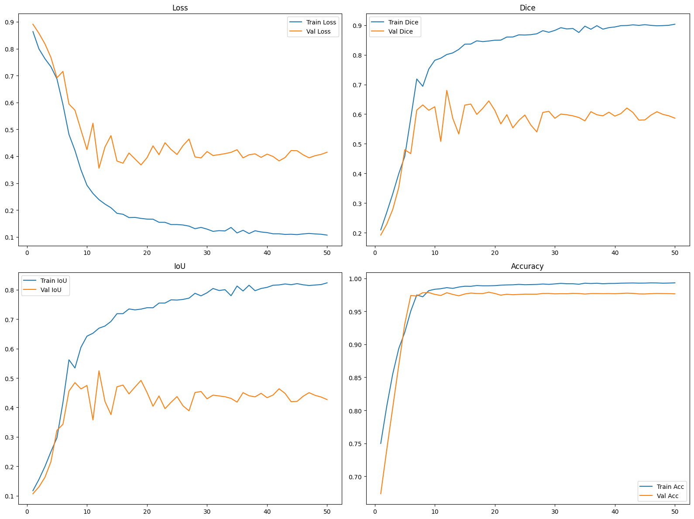
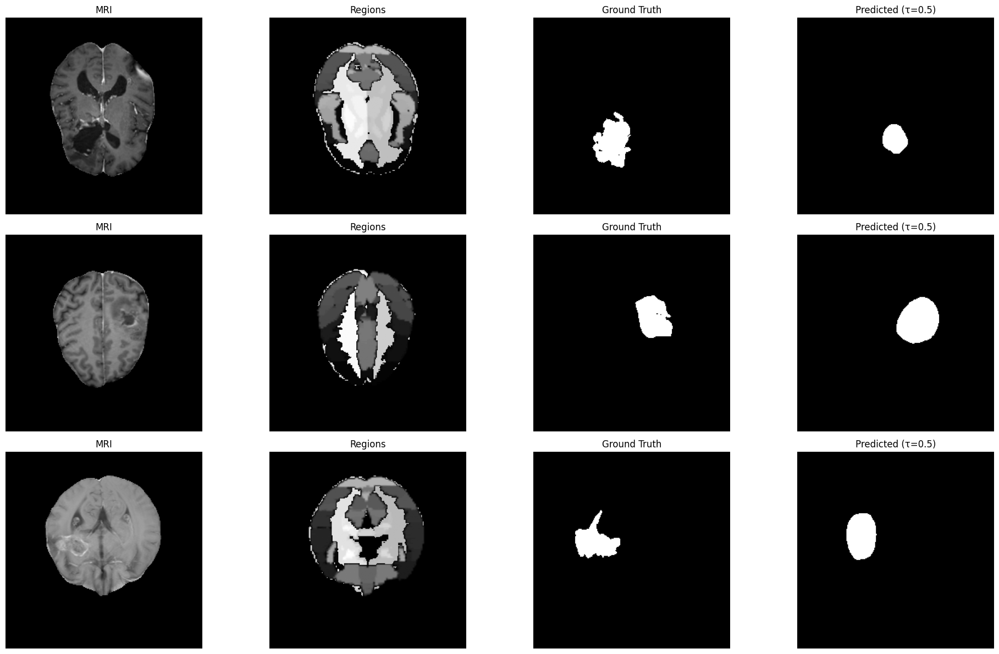
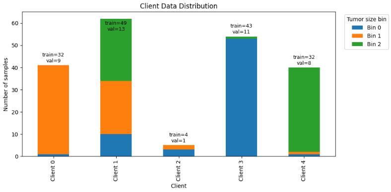

# Federated Learning for Glioma Segmentation

This repository contains the implementation of a **Federated Learning (FL)** system for medical image segmentation, specifically targeting **Glioma tumor segmentation** using MRI scans. The project utilizes **PyTorch** and **Flower (flwr)** to simulate federated learning scenarios with various algorithms and model architectures.

## 📂 Project Structure

The repository is organized as follows:

-   **`Centralized_Training/`**: 📊 Results and artifacts from centralized training baselines (training on the combined dataset without federation).
    -   Subdirectories for different models (e.g., `deeplabv3plus`, `unet_mit_b3`, `unet_resnet50`).
-   **`Data/`**: 💾 Scripts and metadata for dataset management and partitioning.
    -   `cleaned_df.pkl`: Metadata dataframe.
    -   `Preprocessed-Data.zip` / `Preprocessed-Data/`: The directory where the actual image data (`.npy` files) should reside.
    -   `*_clients_*/`: Configurations for splitting data among clients (IID, non-IID, stratified).
-   **`Experiments/`**: 🧪 Core implementation of FL algorithms and experimental results.
    -   `algorithms/`: Implementation of specific FL strategies (`FedAvg`, `FedNova`, `FedOpt`, `FedProx`).
    -   `cross_device/`: Experiments simulating cross-device scenarios.
    -   `rounds_epochs/`: Ablation studies on the number of communication rounds and local epochs.
-   **`notebooks/`**: 📓 Jupyter notebooks for interactive exploration (`Project_AITDM.ipynb`, `aitdm_xai.ipynb`).

## 🏗️ Models

The project explores the following segmentation architectures:

1.  **U-Net** with **ResNet50** backbone.
2.  **U-Net** with **MiT-B3** (Mix Transformer) backbone.
3.  **DeepLabV3+** with **MobileNetV3-Small** backbone.

## 📊 Results & Performance

We evaluated the centralized performance of different models to establish a baseline.

### 🏆 Centralized Training Metrics (Client 0)

| Model Architecture | Best Val Dice |
| :--- | :--- |
| **DeepLabV3+ (MobileNetV3)** | **0.680** |
| U-Net (ResNet50) | 0.655 |
| U-Net (MiT-B3) | 0.643 |

### 📈 Training Curves (DeepLabV3+)



### 🖼️ Segmentation Visualizations

Below are sample predictions from the best performing model on the validation set.



### 🌍 Data Distribution

Visualizing the data split across clients in a non-IID setting (5 clients).



## 🛠️ Key Dependencies

-   🐍 Python 3.x
-   🔥 **PyTorch**: Deep learning framework.
-   🌼 **Flower (`flwr`)**: Federated learning framework.
-   🖼️ **Timm**: PyTorch Image Models (for backbones).
-   🧩 **Segmentation Models PyTorch**: High-level API for segmentation models.
-   📊 **NumPy**, **Pandas**, **Matplotlib**: Data manipulation and visualization.

## 💾 Dataset

The project uses a Glioma MRI dataset. The data loader (`seg_data.py`) expects preprocessed `.npy` files for each patient:
-   `{PatientID}_mri.npy`: The input MRI scan.
-   `{PatientID}_tumor.npy`: The ground truth tumor mask.
-   `{PatientID}_regions.npy`: (Optional) Atlas region information.

Ensure your data is extracted to `Preprocessed-Data/` or update `DATA_ROOT` in the configuration.

## 🚀 Running Experiments

### Federated Learning Simulation
The primary entry point for simulations is typically `fl_sim_colab.py`.

```bash
cd Experiments/algorithms/FedAvg_original_data
python fl_sim_colab.py
```

*Note: Adjust paths in the scripts depending on your working directory.*

### Centralized Training
Baselines can be run to establish upper-bound performance metrics by training on the aggregated data from all clients.

## 🤖 Algorithms Implemented

-   **FedAvg**: The standard federated averaging algorithm.
-   **FedProx**: Adds a proximal term to the local objective to handle heterogeneity.
-   **FedNova**: Normalized averaging to account for varying local updates.
-   **FedOpt**: Adaptive optimization methods in the federated setting.